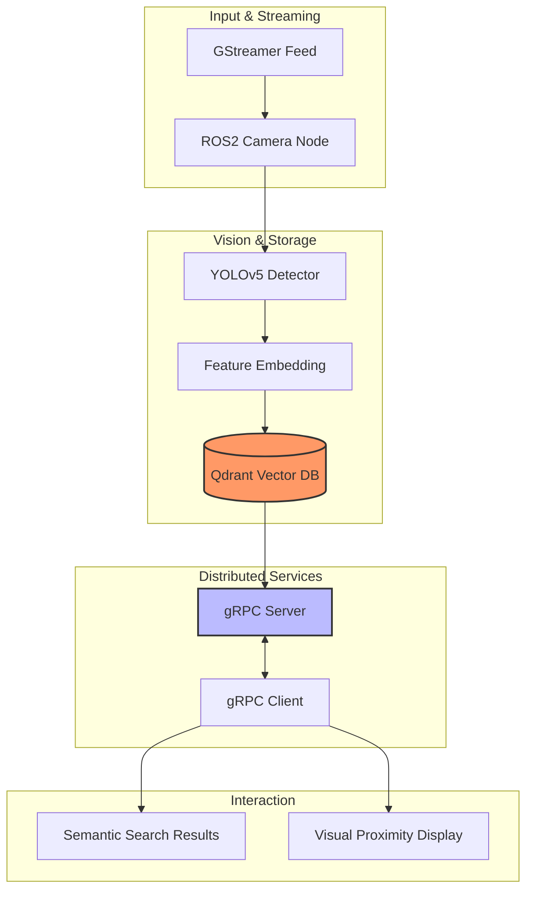

# High-Performance Vector Search & RAG Pipeline

A robust, end-to-end robotics and AI pipeline integrating **ROS2**, **OpenCV**, **YOLOv5**, and **Qdrant**. This project demonstrates real-time camera streaming, object detection, and high-performance semantic querying using a distributed gRPC architecture.

## Key Features

* **Real-time ROS2 Integration:** Utilizes GStreamer for low-latency camera streaming published via `/camera/image_raw`.
* **Vectorized Object Detection:** YOLOv5 identifies objects, generates embeddings, and indexes them into a **Qdrant Vector Database**.
* **Distributed gRPC Architecture:** Uses Remote Procedure Calls (gRPC) to handle heavy vector operations across multiple micro-services, preventing Docker container bottlenecks.
* **Semantic Proximity Querying:** Retrieve and visualize objects (e.g., umbrella, cup, book) based on vector similarity scores.

## System Architecture

It illustrates the flow from raw camera data to the gRPC-queried client.

## Project Structure

## Getting Started

## Prerequisites

- ROS2 (Humble/Foxy)
- Docker & Docker Compose
- OpenCV & GStreamer
- Qdrant Database

## Installation & Usage

1. Clone the repository

git clone [https://github.com/asundar0128/High-Performance-Vector-Search-RAG-Pipeline.git](https://github.com/asundar0128/High-Performance-Vector-Search-RAG-Pipeline.git)
cd High-Performance-Vector-Search-RAG-Pipeline

2. Launch the pipeline

# Ensure your Qdrant instance is running, then start the gRPC server
python3 grpc_server.py

3. Run detection

ros2 run your_package_name yolo_detector_node

## Future Directions

To evolve this pipeline into a production-grade robotics framework, the following enhancements are planned:

- Temporal Memory & SLAM Integration: Moving beyond individual frame detection to a temporal-based system where the robot remembers object locations over time using a global coordinate frame.
- LLM-based Task Planning: Integrating a Large Language Model (LLM) to translate natural language commands (e.g., "Find the coffee cup near the window") into specific vector queries and navigation goals.
- Edge Optimization: Deploying the detection and embedding modules using TensorRT or OpenVINO to maximize throughput on edge devices like the NVIDIA Jetson Orin.
- Dynamic Re-indexing: Implementing a real-time feedback loop where the Qdrant database is updated as objects move within the environment, ensuring the "RAG" component is always current.
